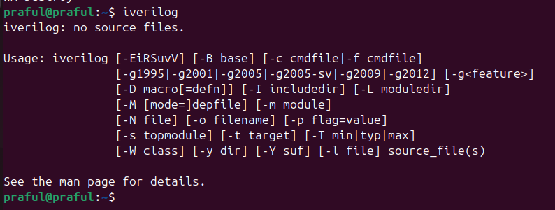
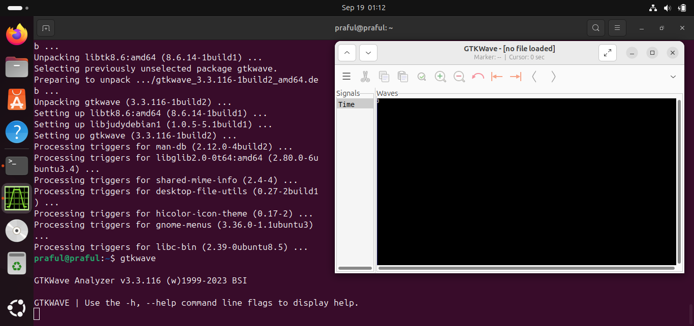
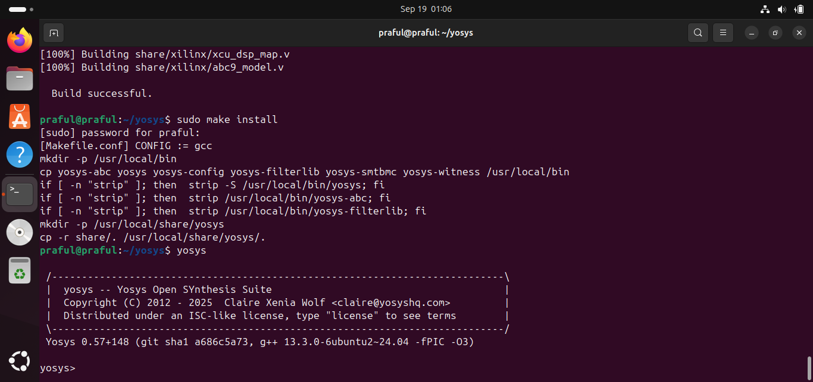
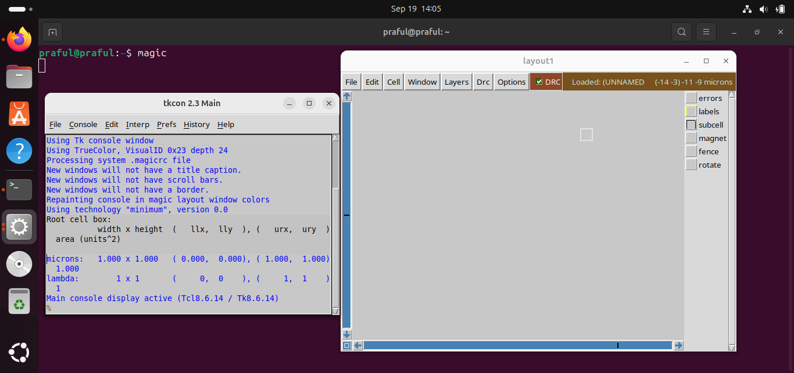
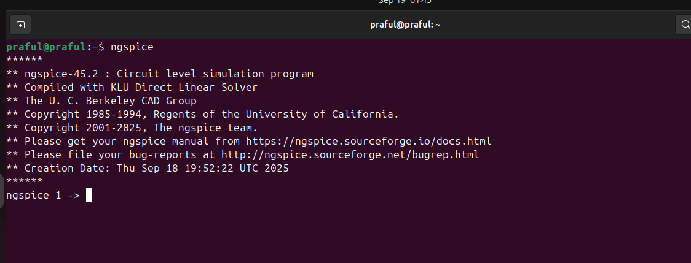
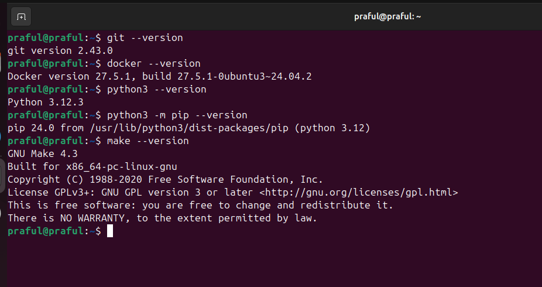

# SFAL VSD – Tool Installation and Setup

This repository contains my work for the SFAL VSD (System-level Functional and Architectural Level Verification for VLSI System Design) program. It documents the video learnings and the complete process of installing and setting up the required open-source EDA tools for VLSI design on an Ubuntu system.

## 📌 Task 1 – Video Summary

### Day 0: Tools Installation Video Summary

* **Introduction:** An overview of the open-source Electronic Design Automation (EDA) tools used in modern VLSI design flows.
* **Environment Setup:** A step-by-step guide to setting up a virtual environment using Oracle VirtualBox and installing Ubuntu 20.04 (or newer).
* **Tool Overview:** A brief on the purpose of each essential tool in the digital design flow:
    * **Yosys:** A framework for Verilog RTL synthesis.
    * **Icarus Verilog:** A Verilog simulation and synthesis tool.
    * **GTKWave:** A popular wave viewer for analyzing simulation results.
    * **NGSpice:** A mixed-level/mixed-signal circuit simulator.
    * **Magic:** A VLSI layout editor and design tool.
    * **OpenLANE:** An automated RTL to GDSII flow for physical design.
* **Importance:** Emphasis on the significance of a robust open-source EDA flow for learning, research, and development in the field of digital VLSI design.

## 📌 Task 2 – Tool Installation

This section details the system configuration and the step-by-step commands used to install all the necessary tools.

### System Configuration (Minimum Requirement)

* **RAM:** 6 GB
* **Storage:** 50 GB Free Space
* **CPU:** 4 Virtual CPUs
* **OS:** Ubuntu 20.04+
* **Virtual Machine:** Oracle VirtualBox

### 🔧 Tool Installation Steps

#### **Initial Setup & Update**

First, open the terminal and update your package lists.

```bash
sudo apt update && sudo apt upgrade -y
```

#### **1. Icarus Verilog (Simulation)**

```bash
sudo apt install iverilog -y
```




#### **2. GTKWave (Waveform Viewer)**

```bash
sudo apt install gtkwave -y
```


#### **3. Yosys (Synthesis Tool)**

```bash
sudo apt install build-essential clang bison flex \
libreadline-dev gawk tcl-dev libffi-dev git \
graphviz xdot pkg-config python3 libboost-system-dev \
libboost-python-dev libboost-filesystem-dev zlib1g-dev -y

git clone [https://github.com/YosysHQ/yosys.git](https://github.com/YosysHQ/yosys.git)
cd yosys
make
sudo make install
cd ..
```


#### **4. Magic (Layout Tool)**

```bash
sudo apt install m4 tcsh csh libx11-dev tcl-dev tk-dev libcairo2-dev \
mesa-common-dev libglu1-mesa-dev libncurses-dev -y

git clone [https://github.com/RTimothyEdwards/magic.git](https://github.com/RTimothyEdwards/magic.git)
cd magic
./configure
make
sudo make install
cd ..
```


#### **5. NGSpice (Analog Simulator)**

The easiest way is to install it from the default repository.

```bash
sudo apt install ngspice -y
```


#### **6. Check Dependencies**
```bash
git --version
docker --version
python3 --version
python3 -m pip --version
make --version
python3 -m venv -h
```



#### **7. OpenLANE (Physical Design Flow)**

OpenLANE runs using Docker. The first step is to install Docker.

```bash
# REmove previous docker versions to avoid conflicts
sudo apt-get remove docker docker-engine docker.io containerd runc

# Update your package index and install dependencies
sudo apt-get update
sudo apt-get install ca-certificates curl gnupg

# Add Docker's official GPG key
sudo install -m 0755 -d /etc/apt/keyrings
curl -fsSL https://download.docker.com/linux/ubuntu/gpg | sudo gpg --dearmor -o /etc/apt/keyrings/docker.gpg
sudo chmod a+r /etc/apt/keyrings/docker.gpg

# Add the Docker repository to your Apt sources
echo \
  "deb [arch="$(dpkg --print-architecture)" signed-by=/etc/apt/keyrings/docker.gpg] https://download.docker.com/linux/ubuntu \
  "$(. /etc/os-release && echo "$VERSION_CODENAME")" stable" | \
  sudo tee /etc/apt/sources.list.d/docker.list > /dev/null

# Update the package index with the new repository
sudo apt-get update

# Install Docker Engine, CLI, and other components
sudo apt-get install docker-ce docker-ce-cli containerd.io docker-buildx-plugin docker-compose-plugin

# Add your user to the 'docker' group (replace 'praful' with your username)
sudo usermod -aG docker praful

# Log out and log back in, or run the following command to apply group changes
newgrp docker
```
**Important:** You need to log out and log back in, or restart your system, for the user group changes to take effect.
```bash
sudo reboot
```
After rebooting, verify the Docker installation:
```bash
docker run hello-world
```

Now, install OpenLANE.

```bash
# Clone the OpenLane repository
cd $HOME
git clone [https://github.com/The-OpenROAD-Project/OpenLane.git](https://github.com/The-OpenROAD-Project/OpenLane.git)

# Navigate to the OpenLane directory and build the environment
cd OpenLane
make
```
Finally, test the installation.
```bash
make test
```
This process will take a considerable amount of time as it pulls docker images and runs a test design flow.
