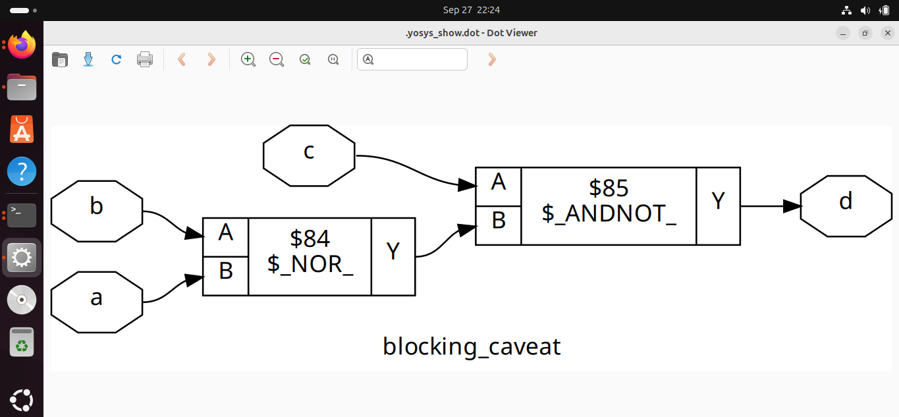
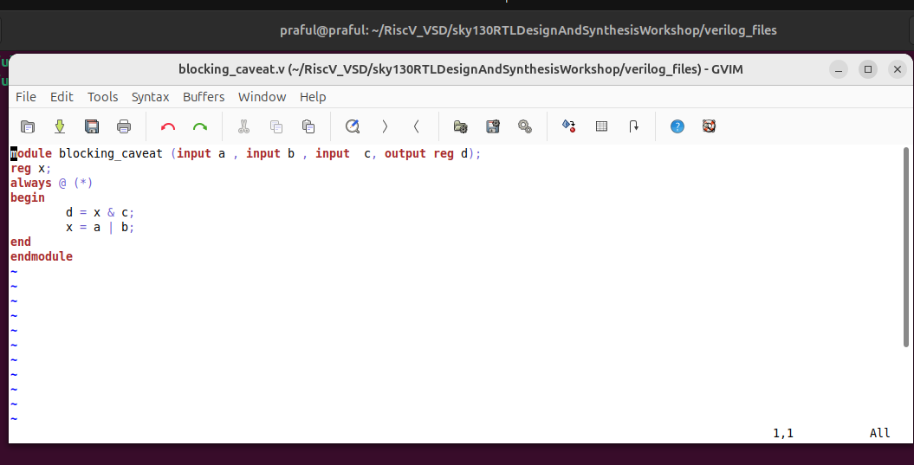
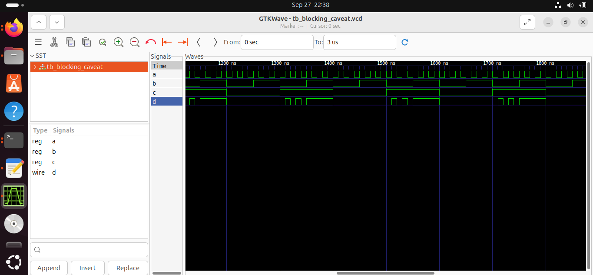

# Blocking Caveat
This project demonstrates how to perform bloacking using **Icarus Verilog**, **Yosys**, and **GTKWave** with the **Sky130 HD Standard Cell Library**.

---

## 📁 Project Setup


## 1. RTL Simulation
```bash
iverilog /home/praful/RiscV_VSD/sky130RTLDesignAndSynthesisWorkshop/my_lib/verilog_model/primitives.v /home/praful/RiscV_VSD/sky130RTLDesignAndSynthesisWorkshop/my_lib/verilog_model/sky130_fd_sc_hd.v blocking_caveat_net.v tb_blocking_caveat.v
./a.out
gtkwave tb_blocking_caveat.vcd
```
# Blocking Caveat
This project demonstrates how to perform bloacking using **Icarus Verilog**, **Yosys**, and **GTKWave** with the **Sky130 HD Standard Cell Library**.

---

## 📁 Project Setup


## 1. RTL Simulation
```bash
iverilog /home/praful/RiscV_VSD/sky130RTLDesignAndSynthesisWorkshop/my_lib/verilog_model/primitives.v /home/praful/RiscV_VSD/sky130RTLDesignAndSynthesisWorkshop/my_lib/verilog_model/sky130_fd_sc_hd.v blocking_caveat_net.v tb_blocking_caveat.v
./a.out
gtkwave tb_blocking_caveat.vcd
```

## 📷 Simulation & Gate-Level Outputs

### 1. RTL Block Diagram


### 2. Gate-Level Netlist View


### 3. GTKWave Simulation



