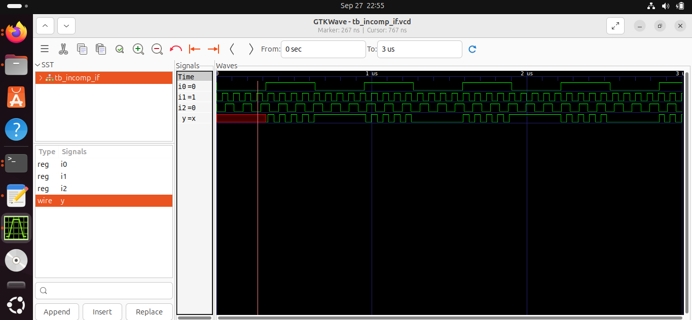
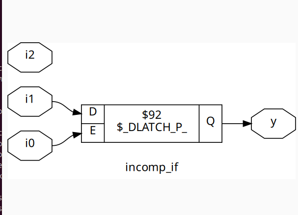
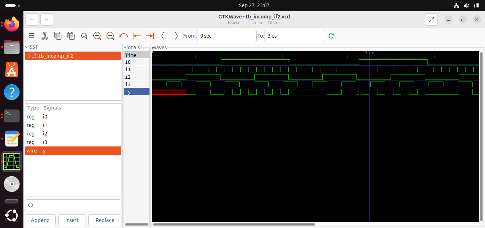
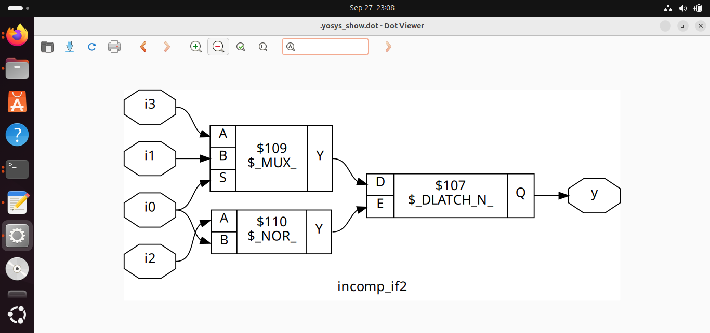
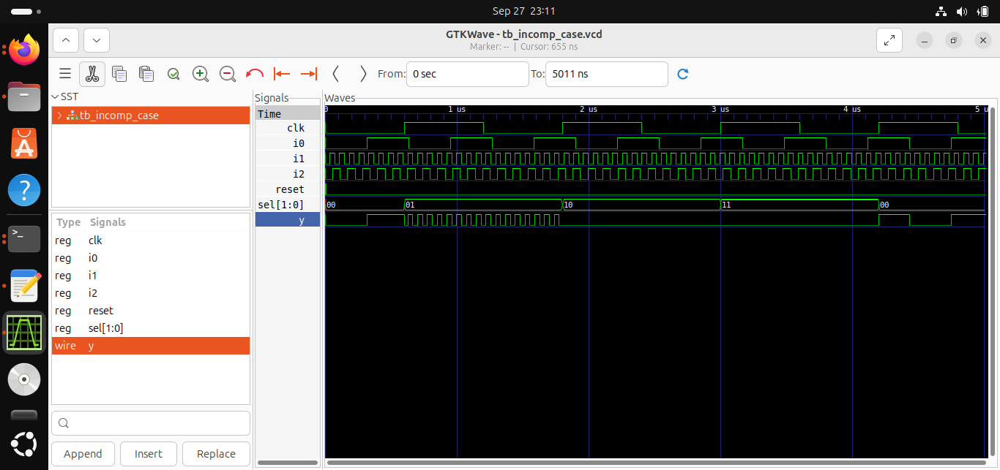
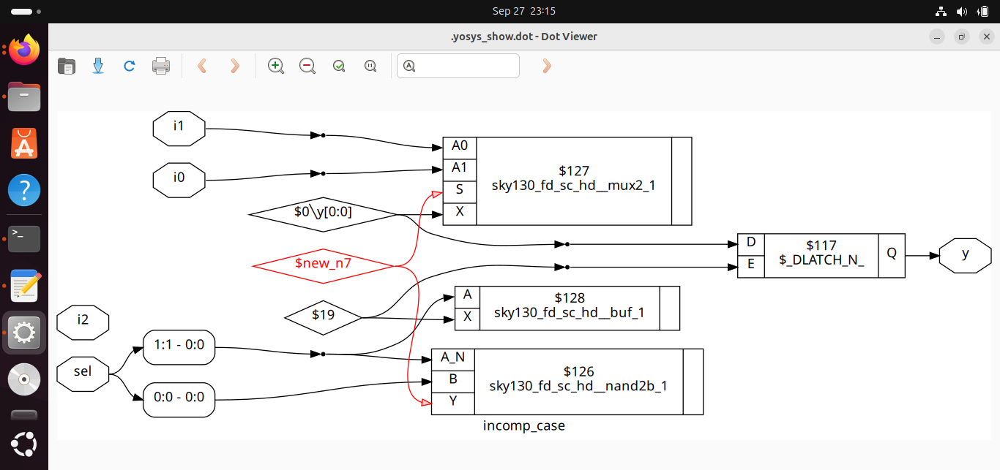
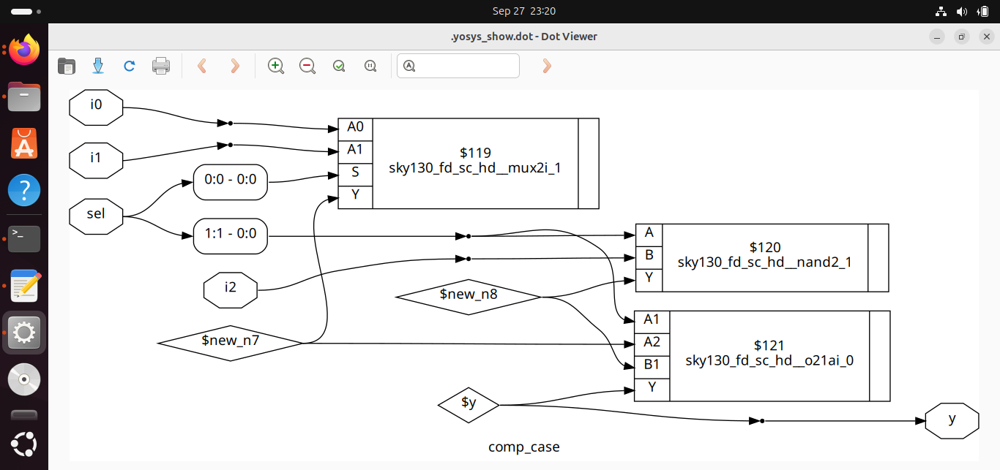
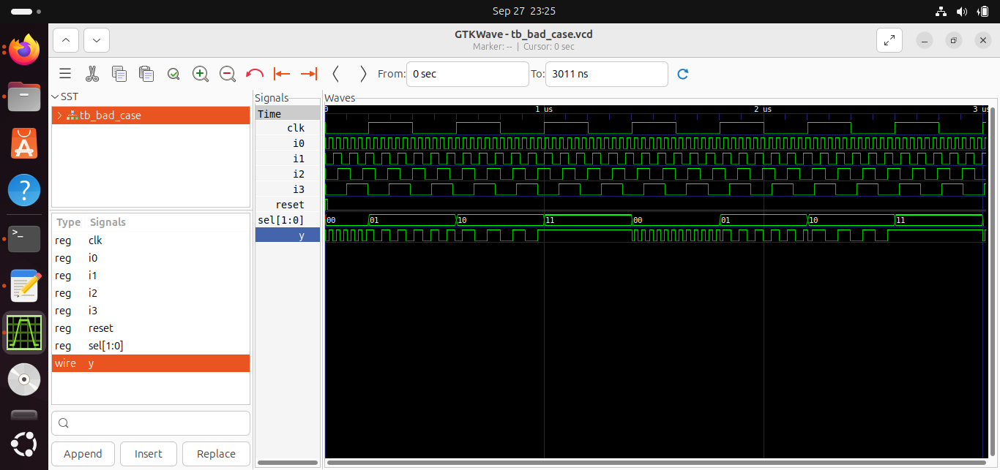
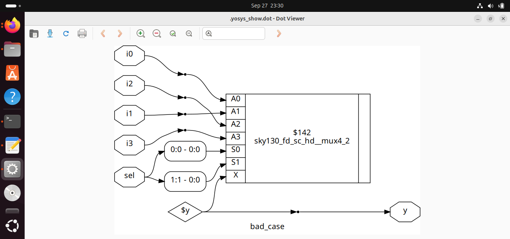
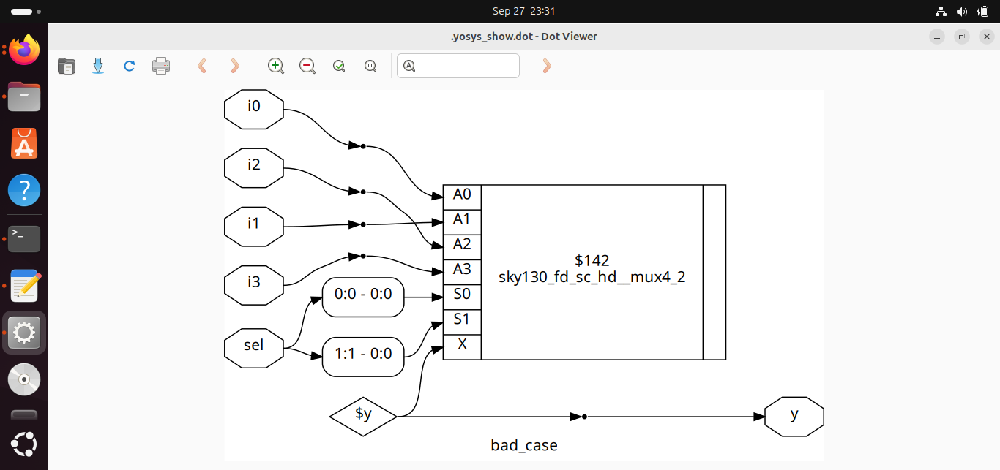

## Incomplete and Complete Case Statements with Sky130
This project demonstrates the simulation and synthesis of incomplete and complete case statements, including bad case handling, using Icarus Verilog, Yosys, and GTKWave with the Sky130 HD Standard Cell Library.

## 1. Incomplete If Statement (incomp_if.v)
### RTL Simulation
```bash
iverilog incomp_if.v tb_incomp_if.v./a.outgtkwave tb_incomp_if.vcd
Synthesis
yosysread_verilog incomp_if.vsynth -top incomp_ifshow
```
### 📷 Outputs


### GTKWave Simulation: 

### Yosys Synthesis Result: 


## 2. Incomplete If-Else Statement (incomp_if2.v)
### RTL Simulation
```bash
iverilog incomp_if2.v tb_incomp_if2.v./a.outgtkwave tb_incomp_if2.vcd
Synthesis
yosysread_verilog incomp_if2.vsynth -top incomp_if2abc -liberty /home/praful/RiscV_VSD/sky130RTLDesignAndSynthesisWorkshop/lib/sky130_fd_sc_hd__tt_025C_1v80.libshow
```
### 📷 Outputs

### GTKWave Simulation: 

### Yosys Synthesis Result: 


## 3. Incomplete Case Statement (incomp_case.v)
### RTL Simulation
```bash
iverilog incomp_case.v tb_incomp_case.v./a.outgtkwave tb_incomp_case.vcd
Synthesis
yosysread_verilog incomp_case.vsynth -top incomp_caseabc -liberty /home/praful/RiscV_VSD/sky130RTLDesignAndSynthesisWorkshop/lib/sky130_fd_sc_hd__tt_025C_1v80.libshow
```
### 📷 Outputs

### GTKWave Simulation: 

### Yosys Synthesis Result: 


## 4. Complete Case Statement (comp_case.v)
### RTL Simulation
```bash
iverilog comp_case.v tb_comp_case.v./a.outgtkwave tb_comp_case.vcd
Synthesis
yosysread_verilog comp_case.vsynth -top comp_caseabc -liberty /home/praful/RiscV_VSD/sky130RTLDesignAndSynthesisWorkshop/lib/sky130_fd_sc_hd__tt_025C_1v80.libshow
```
### 📷 Outputs


### Yosys Synthesis Result: 


## 5. Bad Case Statement (bad_case.v)
### RTL Simulation
```bash
iverilog bad_case.v tb_bad_case.v./a.outgtkwave tb_bad_case.vcd
Synthesis and Netlist Generation
yosysread_verilog bad_case.vsynth -top bad_caseabc -liberty /home/praful/RiscV_VSD/sky130RTLDesignAndSynthesisWorkshop/lib/sky130_fd_sc_hd__tt_025C_1v80.libwrite_verilog -noattr bad_case_net.vshow
```
### Gate-Level Simulation
```bash
iverilog /home/praful/RiscV_VSD/sky130RTLDesignAndSynthesisWorkshop/my_lib/verilog_model/primitives.v \/home/praful/RiscV_VSD/sky130RTLDesignAndSynthesisWorkshop/my_lib/verilog_model/sky130_fd_sc_hd.v \bad_case_net.v tb_bad_case.v./a.outgtkwave tb_bad_case.vcd
```
### 📷 Outputs

### GTKWave Simulation: 

### Yosys Synthesis Result: 
### Netlist View (no attributes): 


`
