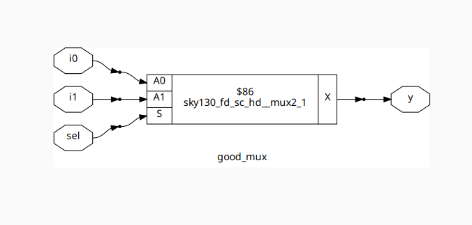
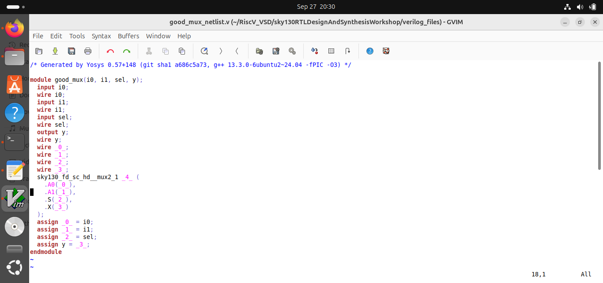
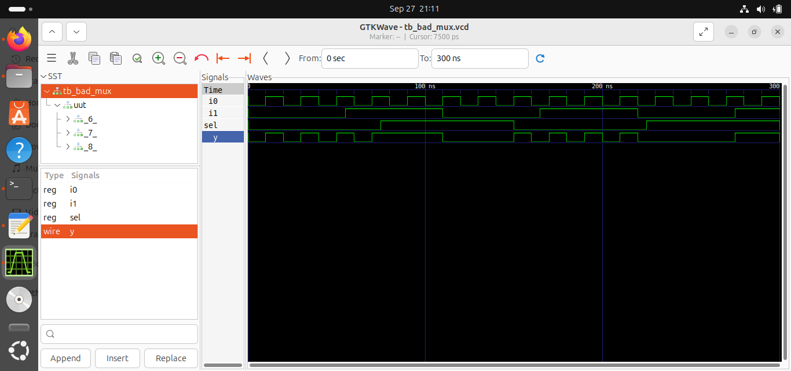
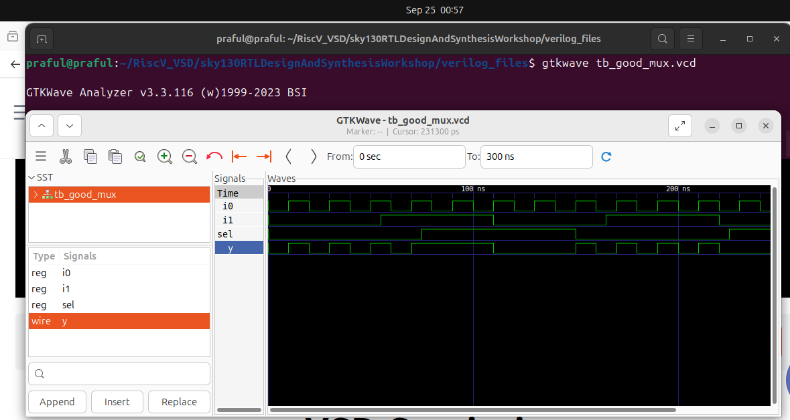
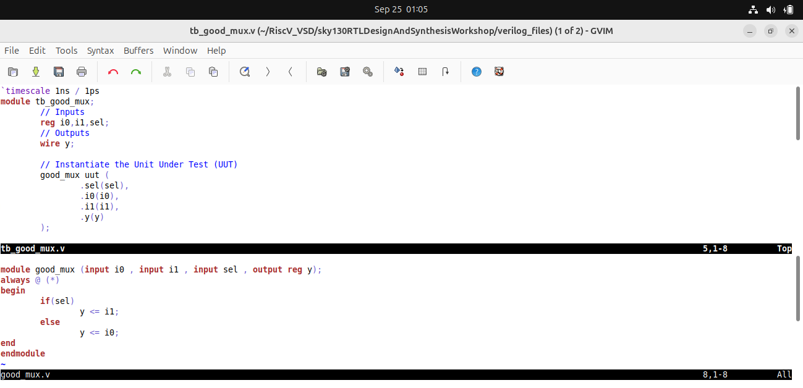

# RTL to Gate-Level Simulation using Sky130 PDK

This project demonstrates how to perform RTL design, simulation, synthesis, and gate-level verification using **Icarus Verilog**, **Yosys**, and **GTKWave** with the **Sky130 HD Standard Cell Library**.

---

## 📁 Project Setup

```bash
mkdir RiscV_VSD
cd RiscV_VSD/
cd sky130RTLDesignAndSynthesisWorkshop/
cd verilog_files/
```
## 1. RTL Simulation
```bash
cd verilog_files/
iverilog good_mux.v tb_good_mux.v
./a.out
gtkwave tb_good_mux.vcd
```
#### View or edit source
```bash
gvim tb_good_mux.v -o good_mux.v
```

## 2. Synthesis Using Yosys
```bash
yosys

# Inside Yosys shell:

read_liberty -lib /home/praful/RiscV_VSD/sky130RTLDesignAndSynthesisWorkshop/lib/sky130_fd_sc_hd__tt_025C_1v80.lib
read_verilog good_mux.v
synth -top good_mux
abc -liberty /home/praful/RiscV_VSD/sky130RTLDesignAndSynthesisWorkshop/lib/sky130_fd_sc_hd__tt_025C_1v80.lib
write_verilog good_mux_netlist.v
write_verilog -noattr good_mux_netlist.v
```

#### Open Generated Netlist
```bash
gvim good_mux_netlist.v
```

## 3. Gate-Level Simulation
```bash
iverilog \
  /home/praful/RiscV_VSD/sky130RTLDesignAndSynthesisWorkshop/my_lib/verilog_model/primitives.v \
  /home/praful/RiscV_VSD/sky130RTLDesignAndSynthesisWorkshop/my_lib/verilog_model/sky130_fd_sc_hd.v \
  ternary_operator_mux_netlist.v \
  tb_ternary_operator_mux.v

./a.out
gtkwave tb_ternary_operator_mux.vcd
```
## Images for reference
## 📷 Simulation & Synthesis Outputs

### 1. Yosys Synthesis



### 2. Netlist View


### 3. GTKWave Simulation
- Bad Mux:
  

- Good Mux:
  

- Ternary Operator Mux:
  

- Gate-Level Simulation (GLS):
  

### 4. Code Editing



